<h1 align="center">Deep Automatic Natural Image Matting [IJCAI-21]</h1>

<p align="center">
<a href="https://arxiv.org/abs/2107.07235">.svg" ></a>
<a href="https://opensource.org/licenses/MIT"></a>
<a href="https://www.ijcai.org/proceedings/2021/111"></a>
<a href="https://paperswithcode.com/sota/image-matting-on-aim-500?p=deep-automatic-natural-image-matting"></a>
</p>


<h4 align="center">This is the official repository of the paper <a href="https://arxiv.org/abs/2107.07235">Deep Automatic Natural Image Matting</a>.</h4>

<h5 align="center"><em>Jizhizi Li, Jing Zhang, and Dacheng Tao</em></h5>


<p align="center">
  <a href="#introduction">Introduction</a> |
  <a href="#network-aimnet">Network</a> |
  <a href="#aim-500">AIM-500</a> |
  <a href="#results-on-aim-500">Results</a> |
  <a href="https://github.com/JizhiziLi/AIM/tree/master/core">Train and Test</a> |
  <a href="#inference-code-how-to-test-on-your-images">Inference code</a> |
  <a href="#statement">Statement</a>
</p>

***
><h3><strong><i>📆 News</i></strong></h3>
> 
> [2021-11-17]: Release the code for training and dataset processing in this [code-base page](https://github.com/JizhiziLi/AIM/tree/master/core).
>
> [2021-10-02]: Publish the network, the [inference code](#inference-code-how-to-test-on-your-images) and the pretrained models in this [code-base page](https://github.com/JizhiziLi/AIM/tree/master/core).
>
> [2021-07-16]: Publish the validation dataset [AIM-500](#aim-500). Please follow the `readme.txt` for details.
>
> | Dataset | <p>Dataset Link<br>(Google Drive)</p> | <p>Dataset Link<br>(Baidu Wangpan 百度网盘)</p> | Dataset Release Agreement|
> | :----:| :----: | :----: | :----: | 
> |<strong>AIM-500</strong>|[Link](https://drive.google.com/drive/folders/1IyPiYJUp-KtOoa-Hsm922VU3aCcidjjz?usp=sharing)|[Link](https://pan.baidu.com/s/1yz476v_vzI8Mh3N3CvXIaQ) (pw: 0l69)|[Agreement (MIT License)](https://jizhizili.github.io/files/aim_dataset_agreement/AIM-500_Dataset_Release_Agreement.pdf)| 
>

## Introduction

<p align="justify">Different from previous methods only focusing on images with <em><u>salient opaque</u></em> foregrounds such as humans and animals, in this paper, we investigate the
difficulties when extending the automatic matting methods to natural images with <em><u>salient
transparent/meticulous</u></em> foregrounds or <em><u>non-salient</u></em> foregrounds.</p>

<p align="justify">To address the problem, we propose a novel end-to-end matting network, which can predict a generalized trimap for any image of the above types as a unified semantic representation. Simultaneously, the learned semantic features guide the matting network to focus on the transition areas via an attention mechanism.</p>

<p align="justify">We also construct a test set <strong>AIM-500</strong> that contains 500 diverse natural images covering all types along with manually labeled alpha mattes, making it feasible to benchmark the generalization ability of AIM models. Results of the experiments demonstrate that our network trained on available composite matting datasets outperforms existing methods both objectively and subjectively.</p>

## Network - AimNet

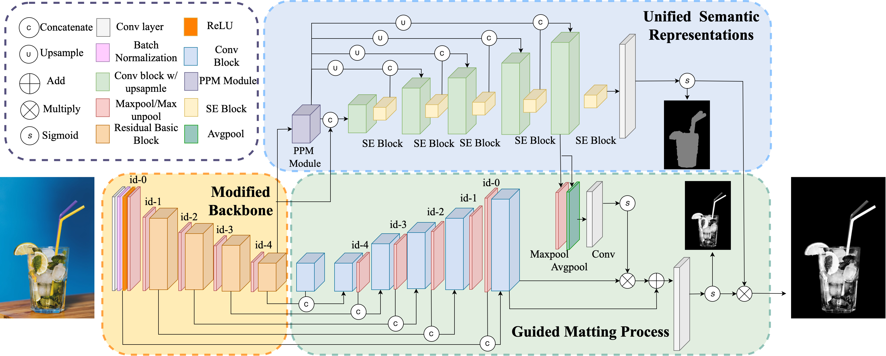

We propose the methods consist of:

- <strong>Improved Backbone for Matting</strong>: an advanced max-pooling version of ResNet-34, serves as the backbone for the matting network, pretrained on ImageNet;

- <strong>Unified Semantic Representation</strong>: a type-wise semantic representation to replace the traditional trimaps;

- <strong>Guided Matting Process</strong>: an attention based mechanism to guide the matting process by leveraging the learned
semantic features from the semantic decoder to focus on extracting details only within transition area.

The backbone pretrained on ImageNet, the model pretrained on DUTS dataset, and the model pretrained on synthetic matting dataset will be released soon.

| Model | Pretrained Backbone on ImageNet | Pretrained Model on DUTS Dataset | Pretrained Model on Synthetic Matting Dataset (update) |
| :----:| :----: | :----: | :----: | 
|Google Drive |<a href="https://drive.google.com/uc?export=download&id=18Pt-klsbkiyonMdGi6dytExQEjzBnHwY">Link</a>|<a href="https://drive.google.com/uc?export=download&id=1EKkKNHvOvUwjFYs_a3iSNn5TpBlGbp1s">Link</a>| <a href="https://drive.google.com/uc?export=download&id=16dd1FGMcsMTqR6EfD2T9mtRmPwxnY0zs">Link</a> |
|<p>Baidu Wangpan<br>(百度网盘)</p>|<p><a href="https://pan.baidu.com/s/1vdMQwtu8lnhtLRPjYFG8rA">Link</a><br>(pw: 2v1t)</p>|<p><a href="https://pan.baidu.com/s/1jb89x41GU9YS0Stac_GdSw">Link</a><br>(pw: ud73)</p>|<p><a href="https://pan.baidu.com/s/1-twrRBtVqNq3uunadJuIaw">Link</a><br>(pw: evik)</p>|


## AIM-500
We propose <strong>AIM-500</strong> (Automatic Image Matting-500), the first natural image matting test set, which contains 500 high-resolution real-world natural images from all three types (SO, STM, NS), many categories, and the manually labeled alpha mattes. Some examples and the amount of each category are shown below. The <strong>AIM-500</strong> dataset is <strong>published</strong> now, can be downloaded directly from [Google Drive](https://drive.google.com/drive/folders/1IyPiYJUp-KtOoa-Hsm922VU3aCcidjjz?usp=sharing) or [Baidu Wangpan (pw: 0l69)](https://pan.baidu.com/s/1yz476v_vzI8Mh3N3CvXIaQ). Please make sure that you have read the [agreement](https://jizhizili.github.io/files/aim_dataset_agreement/AIM-500_Dataset_Release_Agreement.pdf) and agreed to it.

| Portrait | Animal | Transparent | Plant | Furniture | Toy | Fruit |
| :----:| :----: |  :----: |  :----: |  :----: |  :----: |  :----: | 
| 100 | 200 | 34 | 75 | 45 | 36 | 10 | 

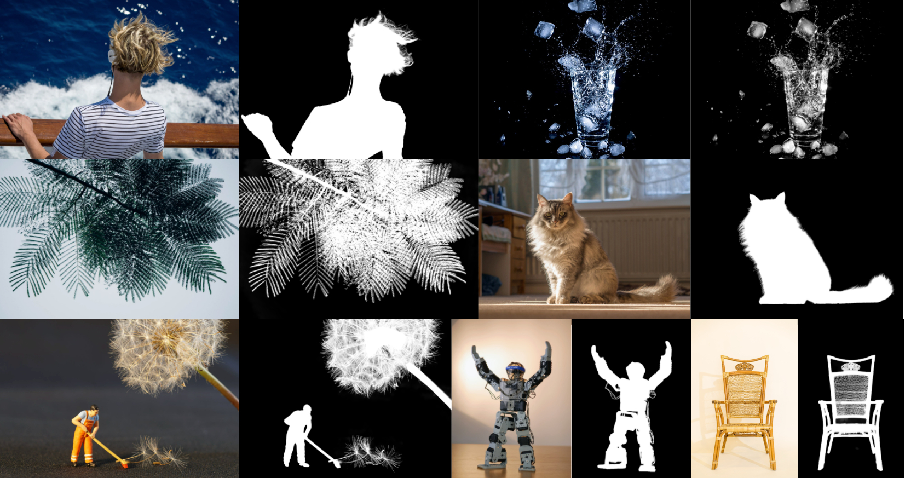


## Results on AIM-500

We test our network on different types of images in AIM-500 and compare with previous SOTA methods, the results are shown below. The code for testing and evaluating on AIM-500 can be checked in this [code-base page](https://github.com/JizhiziLi/AIM/tree/master/core).

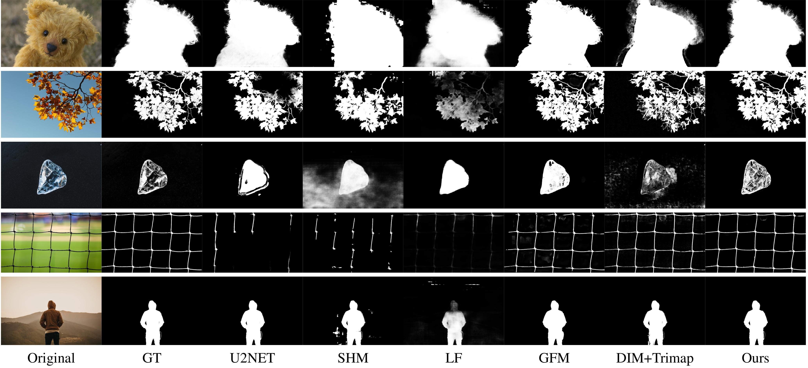

## Inference Code - How to Test on Your Images

Here we provide the procedure of testing on sample images by our pretrained model:

1. Setup environment following this [instruction page](https://github.com/JizhiziLi/AIM/tree/master/core);

2. Insert the path `REPOSITORY_ROOT_PATH` in the file `core/config.py`;

3. Download the pretrained AimNet model from here ([Google Drive](https://drive.google.com/uc?export=download&id=16dd1FGMcsMTqR6EfD2T9mtRmPwxnY0zs)|[Baidu Wangpan (pw: evik)](https://pan.baidu.com/s/1-twrRBtVqNq3uunadJuIaw)) and unzip to the folder `models/pretrained/`;

4. Save your sample images in folder `samples/original/.`;
    
5. Setup parameters in the file `scripts/test_samples.sh` and run by:

    `chmod +x scripts/test_samples.sh`

    `scripts/test_samples.sh`;

6. The results of alpha matte and transparent color image will be saved in folder `samples/result_alpha/.` and `samples/result_color/.`.

We show some sample images from the internet, the predicted alpha mattes, and their transparent results as below. We use the pretrained model from section <a href="#network-aimnet">Network</a> with `Hybrid (1/2 & 1/4)` test strategy.

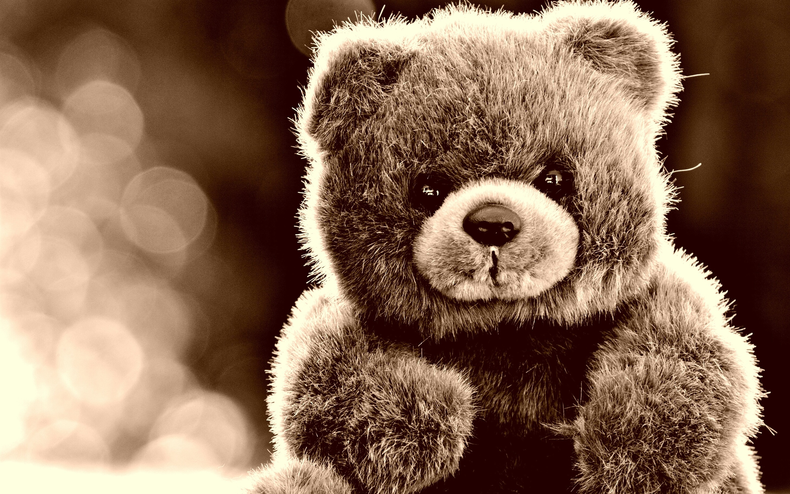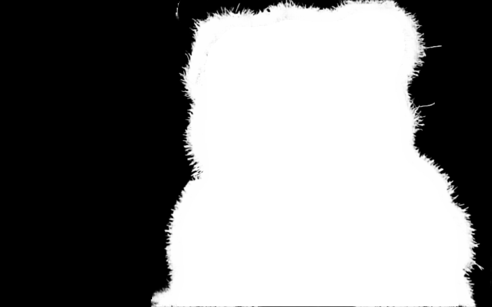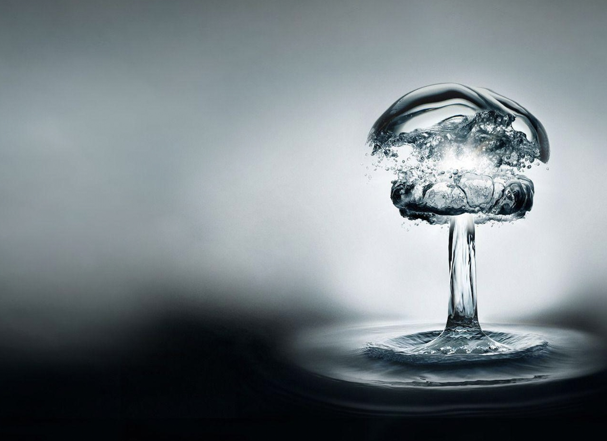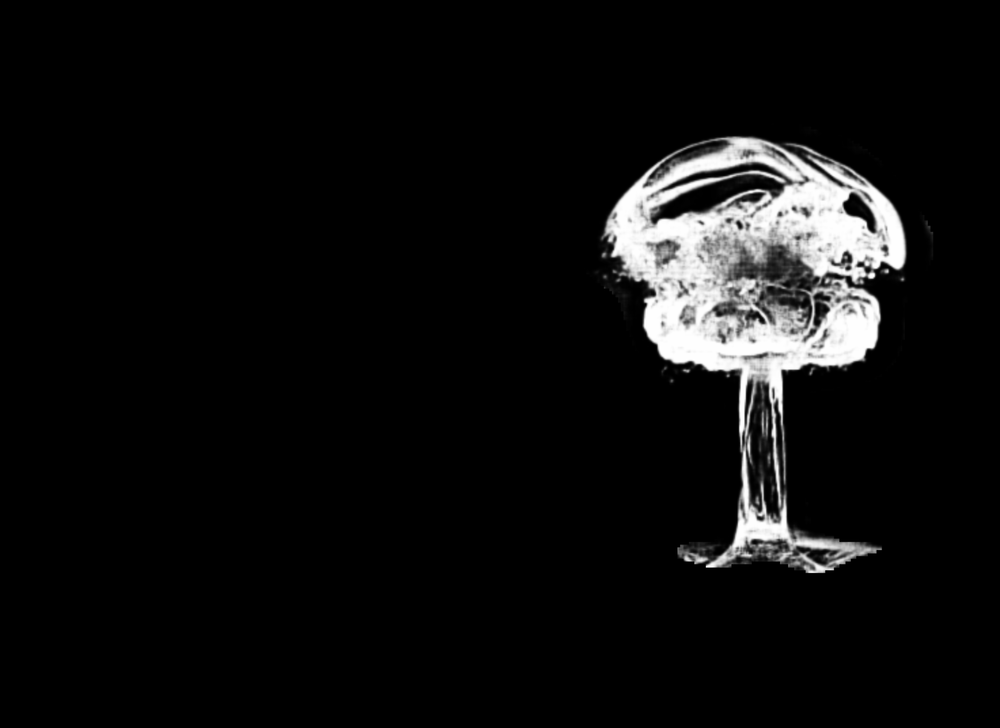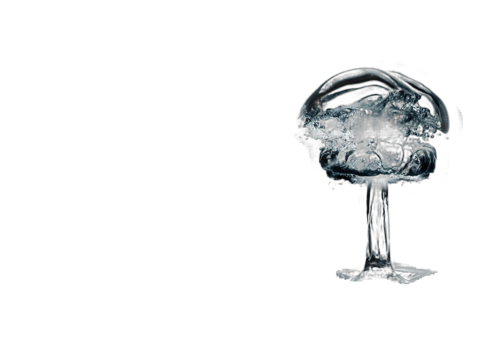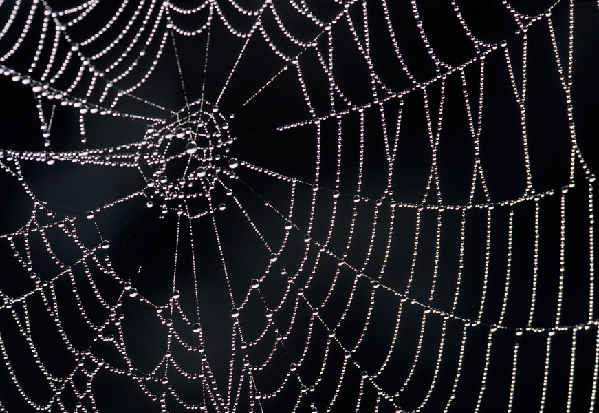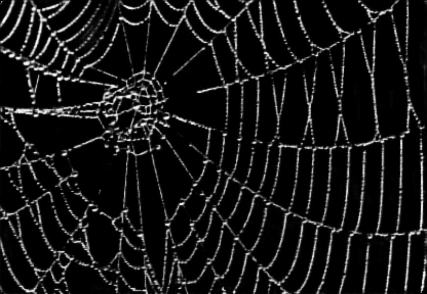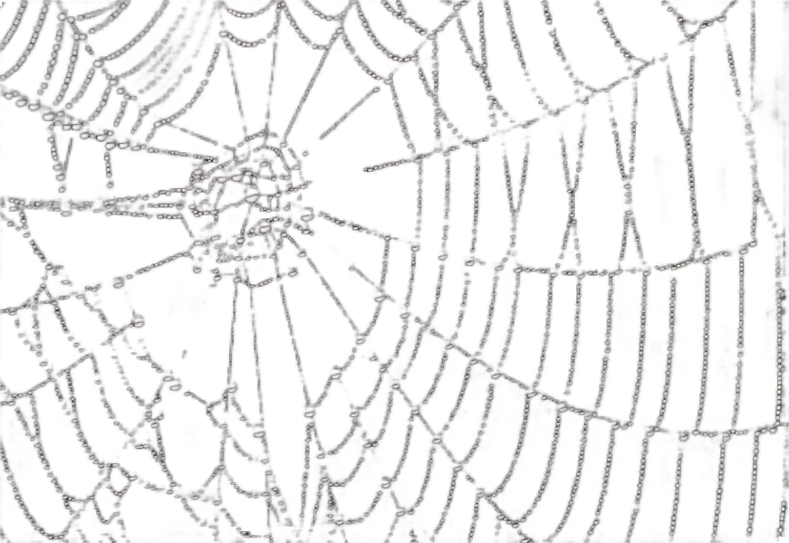


## Statement

If you are interested in our work, please consider citing the following:
```
@inproceedings{ijcai2021-111,
  title     = {Deep Automatic Natural Image Matting},
  author    = {Li, Jizhizi and Zhang, Jing and Tao, Dacheng},
  booktitle = {Proceedings of the Thirtieth International Joint Conference on
               Artificial Intelligence, {IJCAI-21}},
  publisher = {International Joint Conferences on Artificial Intelligence Organization},
  editor    = {Zhi-Hua Zhou},
  pages     = {800--806},
  year      = {2021},
  month     = {8},
  note      = {Main Track}
  doi       = {10.24963/ijcai.2021/111},
  url       = {https://doi.org/10.24963/ijcai.2021/111},
}

```

This project is under the MIT license. For further questions, please contact <strong><i>Jizhizi Li</i></strong> at [jili8515@uni.sydney.edu.au](mailto:jili8515@uni.sydney.edu.au).


## Relevant Projects

<a href="https://github.com/ViTAE-Transformer/ViTAE-Transformer-Matting"></a>
</p>

[1] <strong>Privacy-Preserving Portrait Matting, ACM MM, 2021</strong> | [Paper](https://dl.acm.org/doi/pdf/10.1145/3474085.3475512) | [Github](https://github.com/JizhiziLi/P3M)
<br><em>&ensp; &ensp; &ensp;Jizhizi Li<sup>&#8727;</sup>, Sihan Ma<sup>&#8727;</sup>, Jing Zhang, and Dacheng Tao</em>

[2] <strong>Bridging Composite and Real: Towards End-to-end Deep Image Matting, IJCV, 2022 </strong> | [Paper](https://link.springer.com/article/10.1007/s11263-021-01541-0) | [Github](https://github.com/JizhiziLi/GFM)
<br><em>&ensp; &ensp; &ensp;Jizhizi Li<sup>&#8727;</sup>, Jing Zhang<sup>&#8727;</sup>, Stephen J. Maybank, Dacheng Tao</em>

[3] <strong>Referring Image Matting, CVPR, 2023</strong> | [Paper](https://arxiv.org/abs/2206.05149) | [Github](https://github.com/JizhiziLi/RIM)
<br><em>&ensp; &ensp; &ensp;Jizhizi Li, Jing Zhang, and Dacheng Tao</em>

[4] <strong>Rethinking Portrait Matting with Privacy Preserving, IJCV, 2023</strong> | [Paper](https://arxiv.org/pdf/2203.16828.pdf) | [Github](https://github.com/ViTAE-Transformer/P3M-Net)
<br><em>&ensp; &ensp; &ensp;Sihan Ma<sup>&#8727;</sup>, Jizhizi Li<sup>&#8727;</sup>, Jing Zhang, He Zhang, Dacheng Tao</em>

[5] <strong>Deep Image Matting: A Comprehensive Survey, ArXiv, 2023</strong> | [Paper](https://arxiv.org/abs/2304.04672) | [Github](https://github.com/jizhiziLi/matting-survey)
<br><em>&ensp; &ensp; &ensp;Jizhizi Li, Jing Zhang, and Dacheng Tao</em>