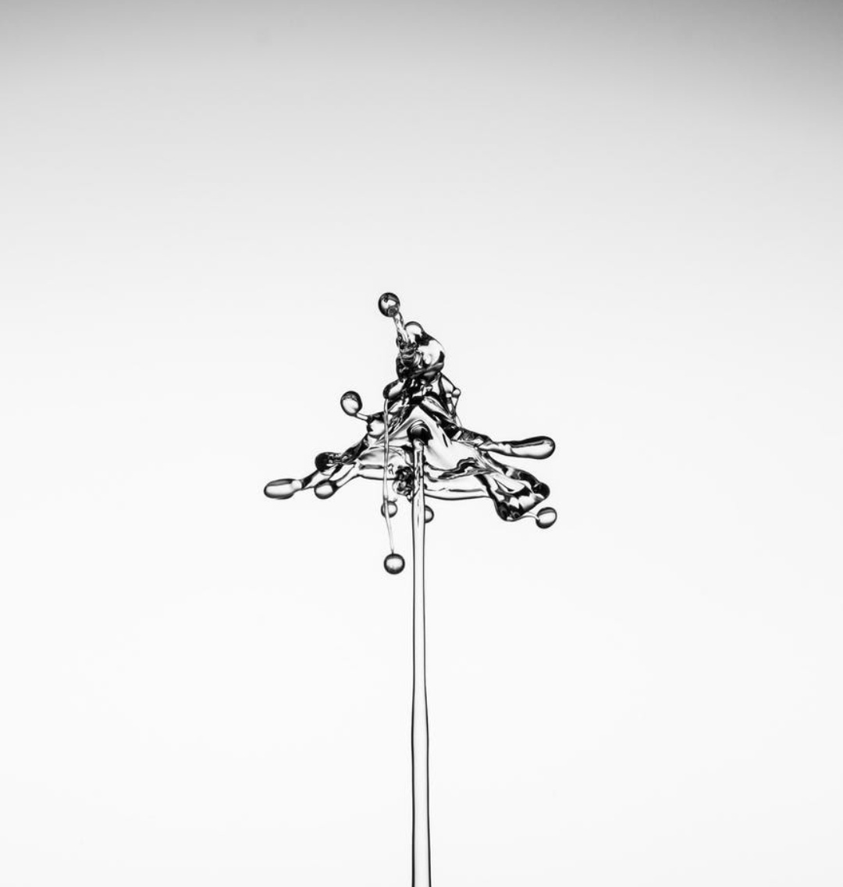
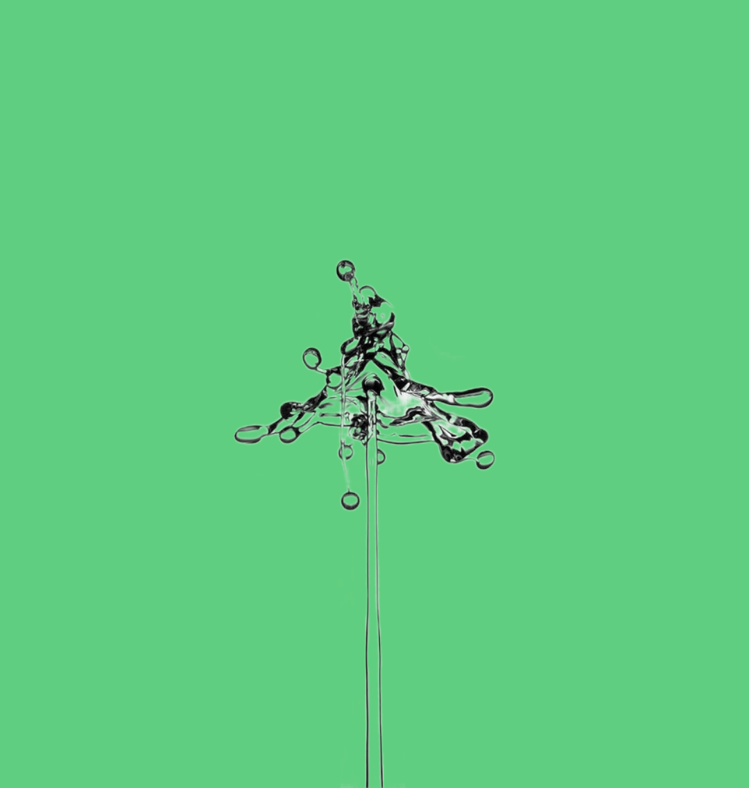
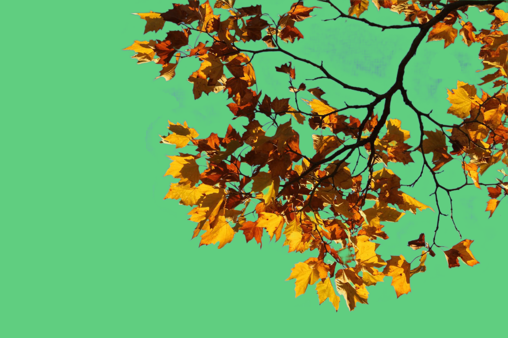
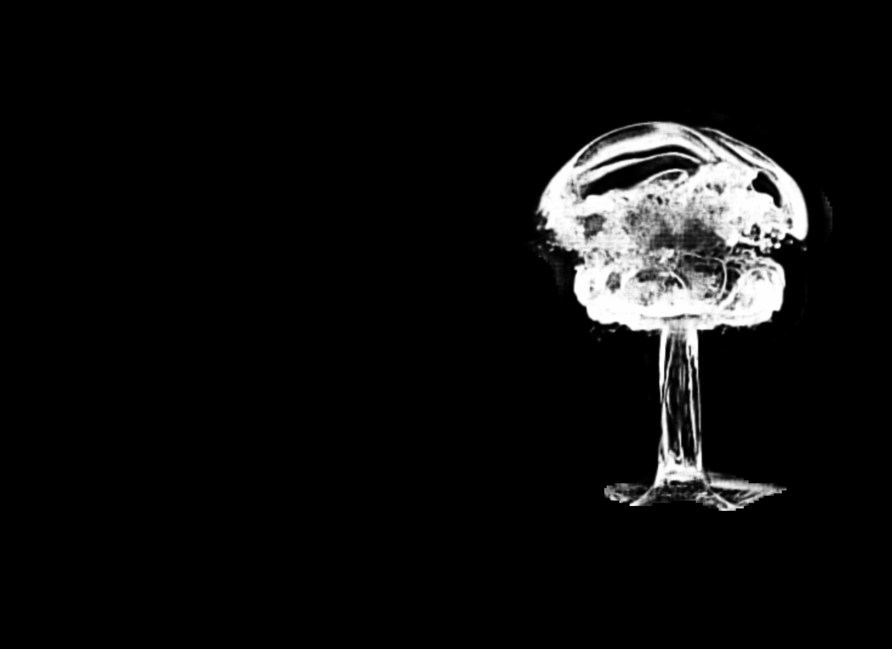
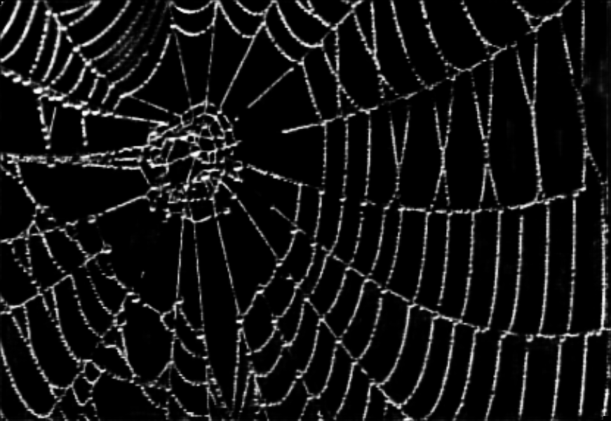

<h1 align="center">Deep Automatic Natural Image Matting [IJCAI-21]</h1>

<p align="center">
<a href="https://arxiv.org/abs/2107.07235">.svg" ></a>
<a href=""></a>
<a href="https://www.ijcai.org/proceedings/2021/111"></a>
<a href="https://paperswithcode.com/sota/image-matting-on-aim-500?p=deep-automatic-natural-image-matting"></a>
</p>


<h4 align="center">This is the official repository of the paper <a href="https://arxiv.org/abs/2107.07235">Deep Automatic Natural Image Matting</a>.</h4>

<h5 align="center"><em>Jizhizi Li, Jing Zhang, and Dacheng Tao</em></h5>


<p align="center">
  <a href="#introduction">Introduction</a> |
  <a href="#network-aimnet">Network</a> |
  <a href="#aim-500">AIM-500</a> |
  <a href="#results">Results</a> |
  <a href="#Installation">Installation</a> |
  <a href="#inference-code">Inference code</a> |
  <a href="#training-code">Training code</a> |
  <a href="#statement">Statement</a>
</p>

***
><h3><strong><i>📆 News</i></strong></h3>
> The training code will be released soon. 
> 
> [2021-10-02]: Publish the network, the inference code and the pretrained models.
>
> [2021-07-16]: Publish the validation dataset [AIM-500](https://drive.google.com/drive/folders/1IyPiYJUp-KtOoa-Hsm922VU3aCcidjjz?usp=sharing). Please follow the `readme.txt` for details.

## Introduction

<p align="justify">Different from previous methods only focusing on images with <em><u>salient opaque</u></em> foregrounds such as humans and animals, in this paper, we investigate the
difficulties when extending the automatic matting methods to natural images with <em><u>salient
transparent/meticulous</u></em> foregrounds or <em><u>non-salient</u></em> foregrounds.</p>

<p align="justify">To address the problem, we propose a novel end-to-end matting network, which can predict a generalized trimap for any image of the above types as a unified semantic representation. Simultaneously, the learned semantic features guide the matting network to focus on the transition areas via an attention mechanism.</p>

<p align="justify">We also construct a test set <strong>AIM-500</strong> that contains 500 diverse natural images covering all types along with manually labeled alpha mattes, making it feasible to benchmark the generalization ability of AIM models. Results of the experiments demonstrate that our network trained on available composite matting datasets outperforms existing methods both objectively and subjectively.</p>

## Network - AimNet


We propose the methods consist of:

- <strong>Improved Backbone for Matting</strong>: an advanced max-pooling version of ResNet-34, serves as the backbone for the matting network, pretrained on ImageNet;

- <strong>Unified Semantic Representation</strong>: a type-wise semantic representation to replace the traditional trimaps;

- <strong>Guided Matting Process</strong>: an attention based mechanism to guide the matting process by leveraging the learned
semantic features from the semantic decoder to focus on extracting details only within transition area.

The backbone pretrained on ImageNet, the model pretrained on DUTS dataset, and the model pretrained on synthetic matting dataset will be released soon.

| Pretrained Backbone on ImageNet | Pretrained Model on DUTS Dataset | Pretrained Model on Synthetic Matting Dataset (update) |
| :----:| :----: | :----: | 
|<a href="https://drive.google.com/uc?export=download&id=18Pt-klsbkiyonMdGi6dytExQEjzBnHwY">Click to download</a>|<a href="https://drive.google.com/uc?export=download&id=1EKkKNHvOvUwjFYs_a3iSNn5TpBlGbp1s">Click to download</a>| <a href="https://drive.google.com/uc?export=download&id=16dd1FGMcsMTqR6EfD2T9mtRmPwxnY0zs">Click to download</a> |


## AIM-500
We propose <strong>AIM-500</strong> (Automatic Image Matting-500), the first natural image matting test set, which contains 500 high-resolution real-world natural images from all three types (SO, STM, NS), many categories, and the manually labeled alpha mattes. Some examples and the amount of each category are shown below. The <strong>AIM-500</strong> dataset is <strong>published</strong> now, can be downloaded directly from [<u>this link</u>](http
s://drive.google.com/drive/folders/1IyPiYJUp-KtOoa-Hsm922VU3aCcidjjz?usp=sharing). Please follow the `readme.txt` for more details.

| Portrait | Animal | Transparent | Plant | Furniture | Toy | Fruit |
| :----:| :----: |  :----: |  :----: |  :----: |  :----: |  :----: | 
| 100 | 200 | 34 | 75 | 45 | 36 | 10 | 


## Results on AIM-500

We test our network on different types of images in AIM-500 and compare with previous SOTA methods, the results are shown below.


## Installation
Requirements:

- Python 3.6.5+ with Numpy and scikit-image
- Pytorch (version 1.4.0)
- Torchvision (version 0.5.0)

1. Clone this repository and go into the repository

    `git clone https://github.com/JizhiziLi/aim.git`

    `cd AIM`

2. Create conda environment and activate

    `conda create -n aim python=3.6.5`

    `conda activate aim`

3. Install dependencies, install pytorch and torchvision separately if you need

    `pip install -r requirements.txt`

    `conda install pytorch==1.4.0 torchvision==0.5.0 cudatoolkit=10.1 -c pytorch`

Our code has been tested with Python 3.6.5, Pytorch 1.4.0, Torchvision 0.5.0, CUDA 10.1 on Ubuntu 18.04.


## Inference Code 

### Test and Evaluate on AIM-500

Here we provide the procedure of testing on AIM-500 dataset and get the evaluation results by our pretrained model:

1. Download AIM-500 dataset from [here](https://drive.google.com/drive/folders/1IyPiYJUp-KtOoa-Hsm922VU3aCcidjjz?usp=sharing) and unzip to your path `/dataset/path/`, insert the path `AIM_DATASET_ROOT_PATH` and `REPOSITORY_ROOT_PATH` in the file `core/config.py`;

2. Download the pretrained AimNet model from [here](https://drive.google.com/uc?export=download&id=16dd1FGMcsMTqR6EfD2T9mtRmPwxnY0zs) and unzip to the folder `models/pretrained/`;
    
3. Setup parameters in the file `scripts/test_dataset.sh` and run by:

    `chmod +x scripts/test_dataset.sh`

    `scripts/test_dataset.sh`;

4. The output will be generated into the folder `args.test_result_dir`, the logging file along with the evaluation results will be in the file `logs/test_logs/args.logname`.


Please note that due to the broken down of the SSD card in our lab's computer, the model we used to report the results in the paper has been corrupted. Thus, we re-trained a model on the synthetic matting dataset and achieved a even better results on AIM-500. We release the updated pretrained model in section <a href="#network-aimnet">Network</a>.

We also report the results in the following table, while `AimNet (paper)` indicates the one used to report in the paper and `AimNet (update)` indicates the re-trained one. With same test strategy `Hybrid (1/3 & 1/4)`, the updated version performs even better than the one in the paper. We also report the objective results and some subjective results of test strategy `Hybrid (1/2 & 1/4)` which has more details in the transition area.


<table>
<caption></caption>
    <thead>
        <tr>
            <th colspan=2></th>
            <th colspan=5>Whole Image</th>
            <th colspan=1>Tran.</th>
            <th colspan=4>SAD-Type</th>
            <th colspan=8>SAD-Category</th>
        </tr>
    </thead>
    <tbody>
        <tr>
            <th>Model</th>
            <th>Test</th>
            <th>SAD</th>
            <th>MSE</th>
            <th>MAD</th>
            <th>Conn.</th>
            <th>Grad.</th>
            <th>SAD</th>
            <th>SO</th>
            <th>STM</th>
            <th>NS</th>
            <th>Avg.</th>
            <th>Animal</th>
            <th>Human</th>
            <th>Transp.</th>
            <th>Plant</th>
            <th>Furni.</th>
            <th>Toy</th>
            <th>Fruit</th>
            <th>Avg.</th>
        </tr>
        <tr>
            <td>AimNet (paper)</td>
            <td>Hybrid (1/3&1/4)</td>
            <td>43.92</td>
            <td>0.0161</td>
            <td>0.0262</td>
            <td>43.18</td>
            <td><strong>33.05</strong></td>
            <td>30.74</td>
            <td>31.80</td>
            <td>94.02</td>
            <td>134.31</td>
            <td>86.71</td>
            <td>26.39</td>
            <td>24.68</td>
            <td>148.68</td>
            <td>54.03</td>
            <td><strong>62.70</strong></td>
            <td>53.15</td>
            <td>37.17</td>
            <td>58.11</td>
        </tr>
          <tr>
            <td>AimNet (update)</td>
            <td>Hybrid (1/3&1/4)</td>
            <td><strong>41.72</strong></td>
            <td><strong>0.0153</strong></td>
            <td><strong>0.0248</strong></td>
            <td><strong>41.23</strong></td>
            <td>33.97</td>
            <td><strong>28.47</strong></td>
            <td><strong>30.57</strong></td>
            <td><strong>86.94</strong></td>
            <td><strong>125.97</strong></td>
            <td><strong>81.16</strong></td>
            <td><strong>24.97</strong></td>
            <td><strong>24.11</strong></td>
            <td><strong>131.20</strong></td>
            <td><strong>52.11</strong></td>
            <td>65.09</td>
            <td><strong>50.11</strong></td>
            <td><strong>35.26</strong></td>
            <td><strong>54.69</strong></td>
        </tr>
        <tr>
            <td>AimNet (update)</td>
            <td>Hybrid (1/2&1/4)</td>
            <td>44.25</td>
            <td>0.0165</td>
            <td>0.0263</td>
            <td>43.78</td>
            <td>34.66</td>
            <td>28.89</td>
            <td>32.48</td>
            <td>91.86</td>
            <td>133.46</td>
            <td>86.27</td>
            <td>26.05</td>
            <td>25.09</td>
            <td>137.31</td>
            <td>57.75</td>
            <td>68.88</td>
            <td>53.81</td>
            <td>36.87</td>
            <td>57.97</td>
        </tr>
    </tbody>
</table>




### Test on Your Sample Images

Here we provide the procedure of testing on sample images by our pretrained model:

1. Insert the path `REPOSITORY_ROOT_PATH` in the file `core/config.py`;

2. Download the pretrained AimNet model from [here](https://drive.google.com/uc?export=download&id=16dd1FGMcsMTqR6EfD2T9mtRmPwxnY0zs) and unzip to the folder `models/pretrained/`;

3. Save your sample images in folder `samples/original/.`;
    
3. Setup parameters in the file `scripts/test_samples.sh` and run by:

    `chmod +x scripts/test_samples.sh`

    `scripts/test_samples.sh`;

4. The results of alpha matte and transparent color image will be saved in folder `samples/result_alpha/.` and `samples/result_color/.`.

We show some sample images from the internet, the predicted alpha mattes, and their transparent results as below. We use the pretrained model from section <a href="#network-aimnet">Network</a> with `Hybrid (1/2 & 1/4)` test strategy.



<!-- ## Training Code 

Here we provide the procedure of training our network on available matting datasets


The matting datasets used in this project can be refer to:

- DIM: please contact the authors of Deep Image Matting for request
- HATT: please refer to https://github.com/yuhaoliu7456/CVPR2020-HAttMatting for request
- AM-2k: please refer to https://github.com/JizhiziLi/animal-matting for request
- BG-20k:  please refer to https://github.com/JizhiziLi/animal-matting for request  -->

## Statement

If you are interested in our work, please consider citing the following:
```
@inproceedings{ijcai2021-111,
  title     = {Deep Automatic Natural Image Matting},
  author    = {Li, Jizhizi and Zhang, Jing and Tao, Dacheng},
  booktitle = {Proceedings of the Thirtieth International Joint Conference on
               Artificial Intelligence, {IJCAI-21}},
  publisher = {International Joint Conferences on Artificial Intelligence Organization},
  editor    = {Zhi-Hua Zhou},
  pages     = {800--806},
  year      = {2021},
  month     = {8},
  note      = {Main Track}
  doi       = {10.24963/ijcai.2021/111},
  url       = {https://doi.org/10.24963/ijcai.2021/111},
}

```

This project is under the MIT license. For further questions, please contact <strong><i>Jizhizi Li</i></strong> at [jili8515@uni.sydney.edu.au](mailto:jili8515@uni.sydney.edu.au).


## Relevant Projects

[1] <strong>Bridging Composite and Real: Towards End-to-end Deep Image Mattin, IJCV, 2021g</strong> | [Paper](https://arxiv.org/pdf/2010.16188v1.pdf) | [Github](https://github.com/JizhiziLi/GFM)
<br><em>&ensp; &ensp; &ensp;Jizhizi Li, Jing Zhang, Stephen J. Maybank, Dacheng Tao</em>

[2] <strong>Privacy-Preserving Portrait Matting, ACM MM, 2021</strong> | [Paper](https://arxiv.org/pdf/2104.14222.pdf) | [Github](https://github.com/JizhiziLi/P3M)
<br><em>&ensp; &ensp; &ensp;Jizhizi Li<sup>&#8727;</sup>, Sihan Ma<sup>&#8727;</sup>, Jing Zhang, and Dacheng Tao</em>
