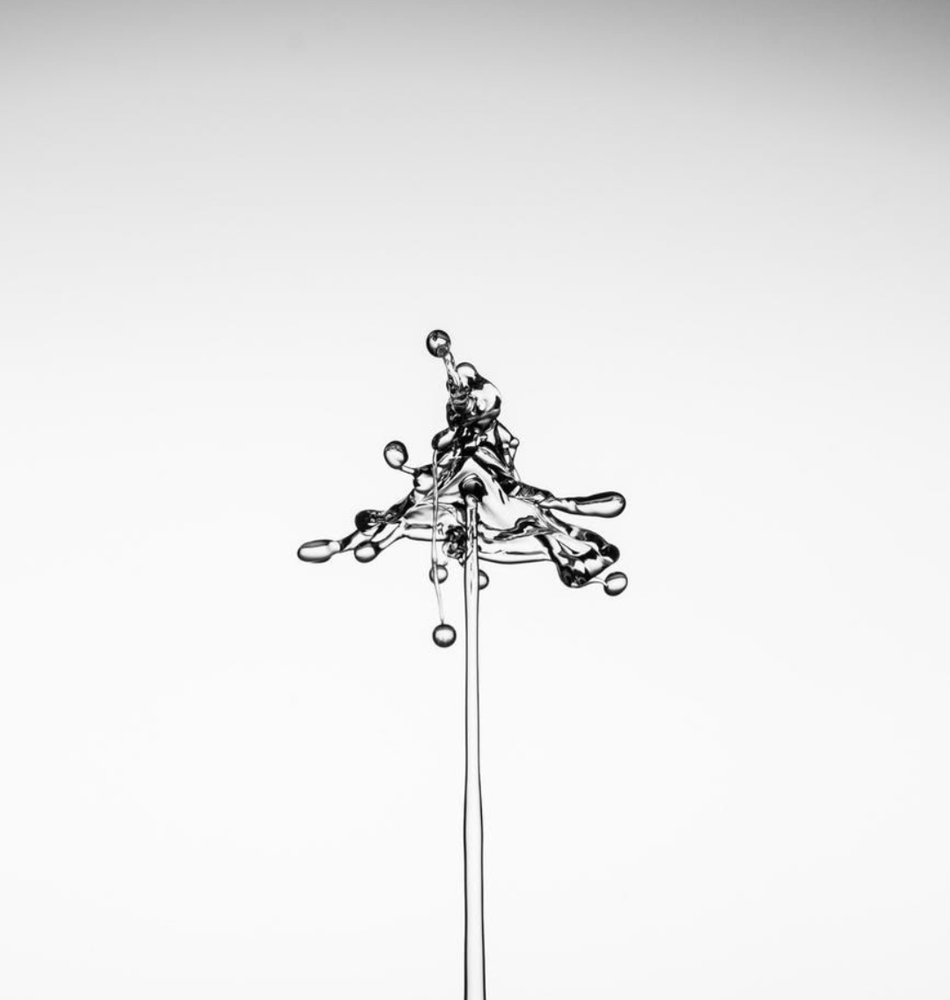
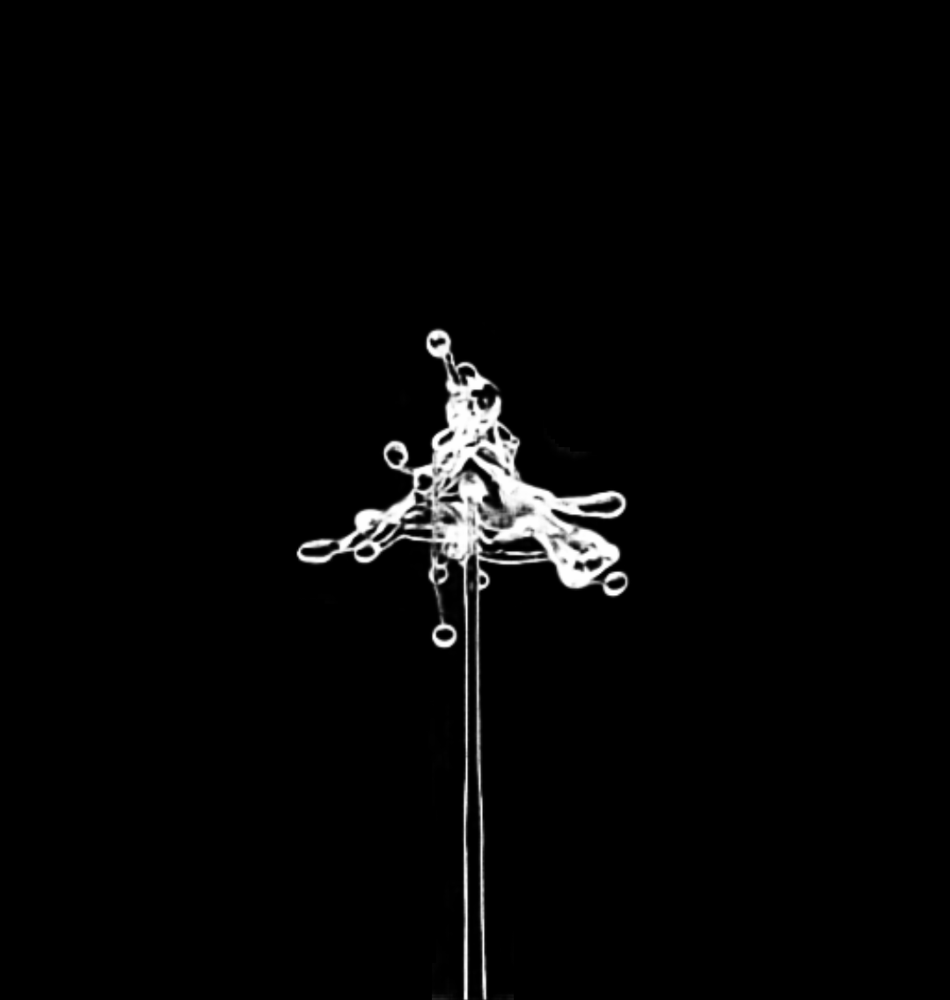
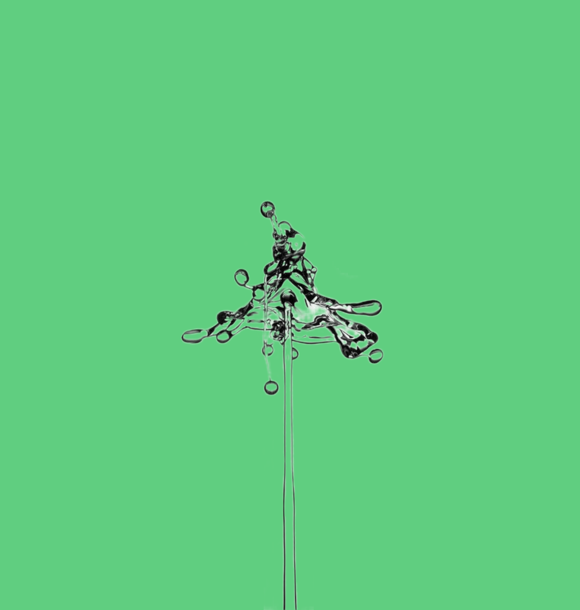

<h1 align="center">Deep Automatic Natural Image Matting [IJCAI-21]</h1>

<p align="center">
  <a href="#installation">Installation</a> |
  <a href="#prepare-datasets">Prepare Datasets</a> |
  <a href="#training-code">Training code</a> |
  <a href="#pretrained-models">Pretrained Models</a> |
  <a href="#test-on-aim-500">Test on AIM-500</a>
</p>


## Installation
Requirements:

- Python 3.7.7+ with Numpy and scikit-image
- Pytorch (version>=1.7.1)
- Torchvision (version 0.8.2)
- Scikit-image (version 0.14.5)

1. Clone this repository and go into the repository

    `git clone https://github.com/JizhiziLi/aim.git`

    `cd AIM`

2. Create conda environment and activate

    `conda create -n aim python=3.7.7`

    `conda activate aim`  

3. Install dependencies, install pytorch and torchvision separately if you need

    `pip install -r requirements.txt`

    `conda install pytorch==1.7.1 torchvision==0.8.2 torchaudio==0.7.2 cudatoolkit=10.2 -c pytorch`

Our code has been tested with Python 3.7.7, Pytorch 1.7.1, Torchvision 0.8.2, CUDA 10.2 on Ubuntu 18.04.

## Prepare Datasets


1. To enable transfer learning, you need to get access to [DUTS train dataset](http://saliencydetection.net/duts/) as refers to `Wang, Lijun and Lu, Huchuan and Wang, Yifan and Feng, Mengyang 
and Wang, Dong, and Yin, Baocai and Ruan, Xiang. "Learning to Detect Salient Objects with Image-level Supervision." CVPR, 2017`.

Download the dataset and set up the configuration `DUTS_DATASET_ROOT_PATH` in the file `core/config.py`

2. To enable synthetic matting training, you need to get access to 

    (1) [DIM dataset](https://sites.google.com/view/deepimagematting) as refers to `Ning Xu, Brian Price, Scott Cohen, Thomas Huang, "Deep Image Matting." CVPR, 2017`.

    (2) [HATT dataset](https://github.com/yuhaoliu7456/CVPR2020-HAttMatting/) as referes to `Yu Qiao, Yuhao Liu, Xin Yang, Dongsheng Zhou, Mingliang Xu, Qiang Zhang, Xiaopeng Wei. "Attention-Guided Hierarchical Structure Aggregation for Image Matting." CVPR, 2020`.

    (3) [AM-2K dataset](https://github.com/JizhiziLi/GFM#am-2k) as refers to `Jizhizi Li, Jing Zhang, Stephen J. Maybank, Dacheng Tao. "Bridging Composite and Real: Towards End-to-end Deep Image Matting." IJCV, 2021`.

    (4) [BG-20K dataset](https://github.com/JizhiziLi/GFM#bg-20k) as refers to `Jizhizi Li, Jing Zhang, Stephen J. Maybank, Dacheng Tao. "Bridging Composite and Real: Towards End-to-end Deep Image Matting." IJCV, 2021`.


3. Generate the unified semantic representations of DIM dataset, HATT dataset and AM-2K dataset following the file `core/process_data.py` and the json file download from [here](https://jizhizili.github.io/files/aim_sources/dim_hatt_am2k_type.json).

3. To enable AIM-500 validation set, please download the dataset from the following link and save to path `AIM_DATASET_ROOT_PATH` in `core/config.py`. Please make sure that you have read [this agreement](https://jizhizili.github.io/files/aim_dataset_agreement/AIM-500_Dataset_Release_Agreement.pdf) before accessing the dataset.

| Dataset | <p>Dataset Link<br>(Google Drive)</p> | <p>Dataset Link<br>(Baidu Wangpan 百度网盘)</p> | Dataset Release Agreement|
| :----:| :----: | :----: | :----: | 
|<strong>AIM-500</strong>|[Link](https://drive.google.com/drive/folders/1IyPiYJUp-KtOoa-Hsm922VU3aCcidjjz?usp=sharing)|[Link](https://pan.baidu.com/s/1yz476v_vzI8Mh3N3CvXIaQ) (pw: 0l69)|[Agreement (MIT License)](https://jizhizili.github.io/files/aim_dataset_agreement/AIM-500_Dataset_Release_Agreement.pdf)| 


After datasets preparation, the structure of the complete datasets should be like the following. 


```text
AM-2k
├── train
    │-- fg
    │-- mask
    │-- usr
DIM
├── train
    │-- fg
    │-- mask
    │-- usr
HATT
├── train
    │-- fg
    │-- mask
    │-- usr
BG-20k
├── train
AIM-500
├── original
├── mask
├── trimap
├── usr
```

## Training Code

### Train on SOD Dataset as Transfer Learning

Here we provide the procedure of training on SOD dataset as transfer learning:

1. Setup the environment following this [section](#installation);

2. Setup required parameters in `core/config.py`;

3. Run the code:
    
    `chmod +x scripts/train/*`,

    `./scripts/train/train_transfer_duts.sh`;

4. The training logging file will be saved in the file `logs/train_logs/args.logname`;

5. The trained model will be saved in the folder `args.model_save_dir`.


### Train on Synthetic Matting Dataset

Here we provide the procedure of training on synthetic matting dataset:

1. Setup the environment following this [section](#installation);

2. Setup required parameters in `core/config.py`, setup the pretrained model path from transfer learning in file `scripts/train/train_matting.sh`;

3. Run the code:
    
    `chmod +x scripts/train/*`,

    `./scripts/train/train_matting.sh`;

4. The training logging file will be saved in the file `logs/train_logs/args.logname`;

5. The trained model will be saved in the folder `args.model_save_dir`.


## Pretrained Models

Here we provide the models of the backbone we pretrained on ImageNet, the model we pretrained on DUTS dataset, and the model we pretrained on synthetic matting dataset.

| Model | Pretrained Backbone on ImageNet | Pretrained Model on DUTS Dataset | Pretrained Model on Synthetic Matting Dataset (update) |
| :----:| :----: | :----: | :----: | 
|Google Drive |<a href="https://drive.google.com/uc?export=download&id=18Pt-klsbkiyonMdGi6dytExQEjzBnHwY">Link</a>|<a href="https://drive.google.com/uc?export=download&id=1EKkKNHvOvUwjFYs_a3iSNn5TpBlGbp1s">Link</a>| <a href="https://drive.google.com/uc?export=download&id=16dd1FGMcsMTqR6EfD2T9mtRmPwxnY0zs">Link</a> |
|<p>Baidu Wangpan<br>(百度网盘)</p>|<p><a href="https://pan.baidu.com/s/1vdMQwtu8lnhtLRPjYFG8rA">Link</a><br>(pw: 2v1t)</p>|<p><a href="https://pan.baidu.com/s/1jb89x41GU9YS0Stac_GdSw">Link</a><br>(pw: ud73)</p>|<p><a href="https://pan.baidu.com/s/1-twrRBtVqNq3uunadJuIaw">Link</a><br>(pw: evik)</p>|

### Test on AIM-500

Here we provide the procedure of testing on AIM-500 dataset and get the evaluation results by our pretrained model:

1. Setup environment following this [instruction page](#installation).

2. Download AIM-500 dataset from [Google Drive](https://drive.google.com/drive/folders/1IyPiYJUp-KtOoa-Hsm922VU3aCcidjjz?usp=sharing) or [Baidu Wangpan (pw: 0l69)](https://pan.baidu.com/s/1yz476v_vzI8Mh3N3CvXIaQ) and unzip to your path and insert the path `AIM_DATASET_ROOT_PATH` and `REPOSITORY_ROOT_PATH` in the file `core/config.py`;

3. Download the pretrained AimNet model from here ([Google Drive](https://drive.google.com/uc?export=download&id=16dd1FGMcsMTqR6EfD2T9mtRmPwxnY0zs)|[Baidu Wangpan (pw: evik)](https://pan.baidu.com/s/1-twrRBtVqNq3uunadJuIaw)) and unzip to the folder `models/pretrained/`;
    
4. Setup parameters in the file `scripts/test_dataset.sh` and run by:

    `chmod +x scripts/test_dataset.sh`

    `scripts/test_dataset.sh`;

5. The output will be generated into the folder `args.test_result_dir`, the logging file along with the evaluation results will be in the file `logs/test_logs/args.logname`.

Please note that due to the broken down of the SSD card in our lab's computer, the model we used to report the results in the paper has been corrupted. Thus, we re-trained a model on the synthetic matting dataset and achieved a even better results on AIM-500. We release the updated pretrained model in section <a href="#pretrained-models">Network</a>.

We also report the results in the following table, while `AimNet (paper)` indicates the one used to report in the paper and `AimNet (update)` indicates the re-trained one. With same test strategy `Hybrid (1/3 & 1/4)`, the updated version performs even better than the one in the paper. We also report the objective results and some subjective results of test strategy `Hybrid (1/2 & 1/4)` which has more details in the transition area.

<table>
<caption></caption>
    <thead>
        <tr>
            <th colspan=2></th>
            <th colspan=5>Whole Image</th>
            <th colspan=1>Tran.</th>
            <th colspan=4>SAD-Type</th>
            <th colspan=8>SAD-Category</th>
        </tr>
    </thead>
    <tbody>
        <tr>
            <th>Model</th>
            <th>Test</th>
            <th>SAD</th>
            <th>MSE</th>
            <th>MAD</th>
            <th>Conn.</th>
            <th>Grad.</th>
            <th>SAD</th>
            <th>SO</th>
            <th>STM</th>
            <th>NS</th>
            <th>Avg.</th>
            <th>Animal</th>
            <th>Human</th>
            <th>Transp.</th>
            <th>Plant</th>
            <th>Furni.</th>
            <th>Toy</th>
            <th>Fruit</th>
            <th>Avg.</th>
        </tr>
        <tr>
            <td>AimNet (paper)</td>
            <td>Hybrid (1/3&1/4)</td>
            <td>43.92</td>
            <td>0.0161</td>
            <td>0.0262</td>
            <td>43.18</td>
            <td><strong>33.05</strong></td>
            <td>30.74</td>
            <td>31.80</td>
            <td>94.02</td>
            <td>134.31</td>
            <td>86.71</td>
            <td>26.39</td>
            <td>24.68</td>
            <td>148.68</td>
            <td>54.03</td>
            <td><strong>62.70</strong></td>
            <td>53.15</td>
            <td>37.17</td>
            <td>58.11</td>
        </tr>
          <tr>
            <td>AimNet (update)</td>
            <td>Hybrid (1/3&1/4)</td>
            <td><strong>41.72</strong></td>
            <td><strong>0.0153</strong></td>
            <td><strong>0.0248</strong></td>
            <td><strong>41.23</strong></td>
            <td>33.97</td>
            <td><strong>28.47</strong></td>
            <td><strong>30.57</strong></td>
            <td><strong>86.94</strong></td>
            <td><strong>125.97</strong></td>
            <td><strong>81.16</strong></td>
            <td><strong>24.97</strong></td>
            <td><strong>24.11</strong></td>
            <td><strong>131.20</strong></td>
            <td><strong>52.11</strong></td>
            <td>65.09</td>
            <td><strong>50.11</strong></td>
            <td><strong>35.26</strong></td>
            <td><strong>54.69</strong></td>
        </tr>
        <tr>
            <td>AimNet (update)</td>
            <td>Hybrid (1/2&1/4)</td>
            <td>44.25</td>
            <td>0.0165</td>
            <td>0.0263</td>
            <td>43.78</td>
            <td>34.66</td>
            <td>28.89</td>
            <td>32.48</td>
            <td>91.86</td>
            <td>133.46</td>
            <td>86.27</td>
            <td>26.05</td>
            <td>25.09</td>
            <td>137.31</td>
            <td>57.75</td>
            <td>68.88</td>
            <td>53.81</td>
            <td>36.87</td>
            <td>57.97</td>
        </tr>
    </tbody>
</table>


